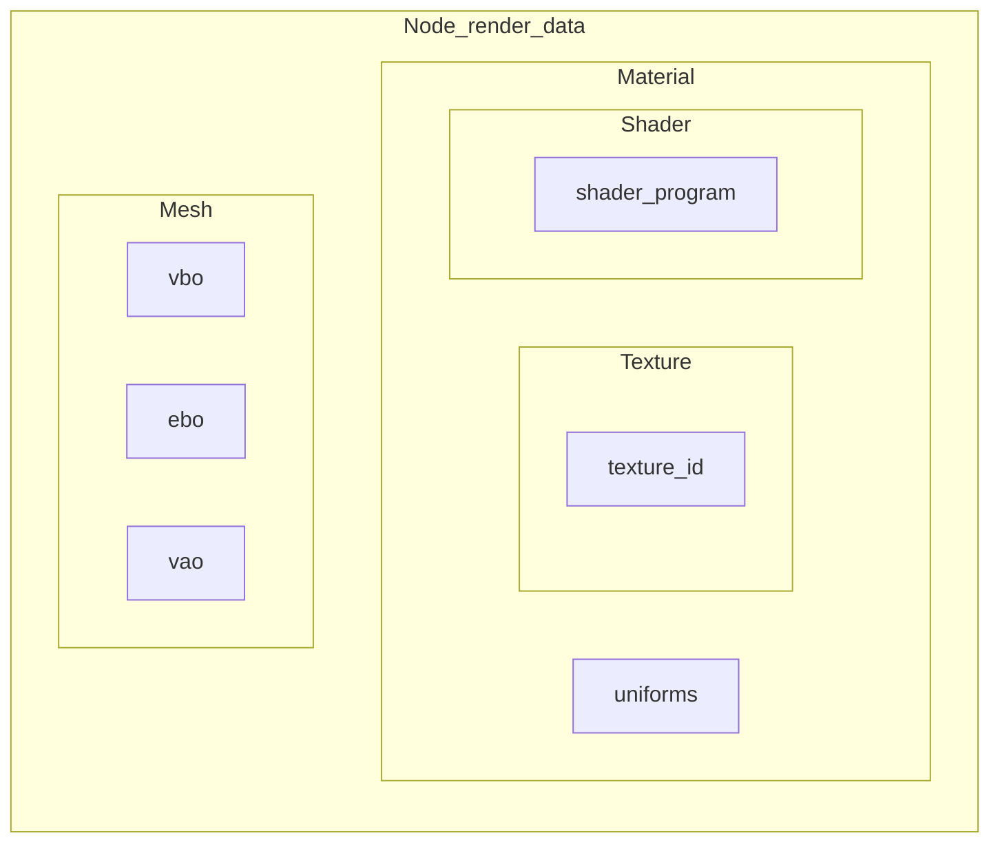

# OpenGL

Vamos nesta tarefa implementar um renderizador para nossa aplicação utilizando OpenGL, uma API para utilizar o hardware gráfico.

Para a renderização de uma geometria, precisamos definir seus buffers, shader de vértice, shader de fragmento e dados como texturas. Nossa aplicação irá abstrair estes conceitos em algumas classes:

- `Shader`: irá receber o arquivo dos shaders, compilá-los e linkar o programa
- `Texture`: irá ler e gerenciar texturas
- `Material`: a junção de um `Shader` com os dados necessários para utilizá-lo, como uniforms e `Texture`
- `Mesh`: irá gerar os buffers necessários a partir dos vértices, índices, UVs e outros dados

Para renderizar um nó, ele precisará ter um `Material` e `Mesh` no seu `render_data`.

## Estrutura da atividade

Esta atividade faz parte de uma sequência de atividades de computação gráfica. Elas possuem dependências entre si, onde o código de uma atividade anterior poderá ser reutilizado futuramente.

Os códigos a serem implementados podem estar em duas pastas diferentes: "src" para implementações do pacote do renderizador em si, "entrypoints" para códigos que usarão o renderizador implementado para desenhar cenas. Os entrypoints podem ser úteis para checar as implementações do pacote.

> Procure por trechos com `## SEU CÓDIGO AQUI` em arquivos .py, .vs e .fs

A entrega deve ser pelo GitHub, consistindo tanto do código desenvolvido quanto de imagens e vídeos gerados.

## Tarefas a serem realizadas

Copie os arquivos da tarefa anterior:

- [ ] urenderer/node/node.py
- [ ] urenderer/node/camera.py
- [ ] urenderer/aplication/runtime.py: copie **apenas** as funções que implementou na última tarefa.

Os arquivos indicados possuem mais informações quando necessário. Observe que, nos entrypoints, também pode ser necessário editar os arquivos de shaders `.vs` e `.fs`

- [ ] Analise o entrypoint 00-hello.py. Ele contém a renderização de um triângulo utilizando OpenGL

## Renderizando utilizando nossa aplicação

- [ ] urenderer/renderer/opengl/shader.py: implemente a compilação e linkagem de shaders, assim como o seu uso e uso de uniforms.
- [ ] urenderer/geometry/mesh/mesh.py: implemente a geração e uso dos buffers de uma mesh.
- [ ] urenderer/renderer/opengl/opengl_renderer.py: implemente a inicialização, uso das transformações e exibição do buffer de renderização.
- [ ] Entrypoint 01-hello_cube.py: implemente o shader para utilizar as transformações de coordenadas e verifique o funcionamento do renderizador.

## Texturas

- [ ] urenderer/renderer/opengl/texture.py: implemente a geração de buffer e uso de texturas.
- [ ] Entrypoint 02-cube_texture.py: renderize um cubo com textura.
- [ ] Entrypoint 03-cube_sisters.py: reutilize geometrias e texturas.

## Shaders e cores de vértice

- [ ] Entrypoint 04-colors.py: utilize cores de vértices e interpolação para renderizar um triângulo colorido.
- [ ] Entrypoint 05-cube_rainbow_madness.py: crie vários cubos com cores animadas.

## Executando o código

1. Instale o pacote na pasta raiz do repositório: `python -m pip install -e .`
   - Observe que o comando instala o pacote no modo editável (opção `-e`), isto significa que qualquer modificação que você fizer nele é diretamente refletida ao utilizar.
2. Execute os entrypoings na pasta "entrypoints": `python xx-nome.py`

Obs: utilize `python` ou `python3` de acordo com seu sistema.

## Correção

As tarefas do urenderer valem 50% da nota, enquanto que os entrypoints valem 50%.